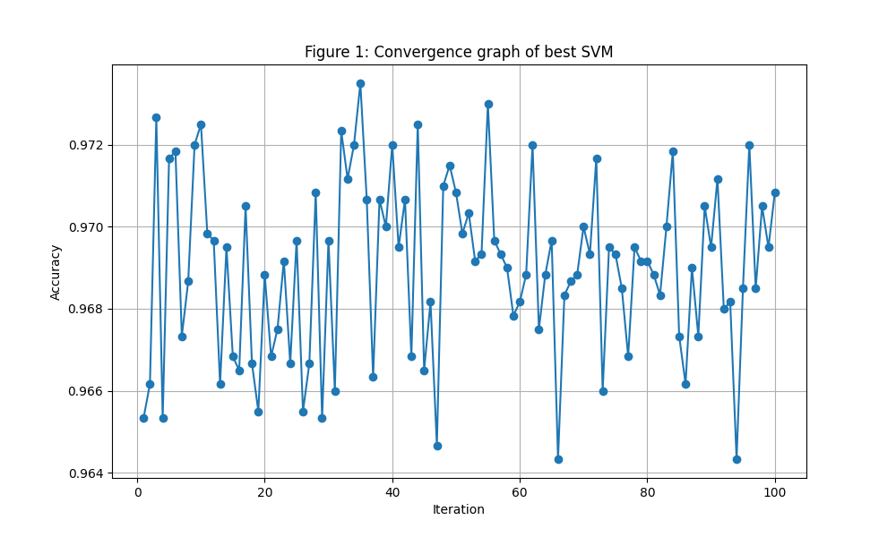

# 📌 Optimized SVM on UCI Letter Recognition Dataset

This project applies Support Vector Machines (SVM) to the UCI Letter Recognition dataset using 10 different randomized train-test splits. Each sample is optimized over 100 iterations using Grid Search. The goal is to analyze how parameter tuning impacts classification accuracy on a multi-class problem with 26 labels.

---

## 📂 Dataset Overview

- **Name**: Letter Recognition Dataset  
- **Source**: [UCI Machine Learning Repository](https://archive.ics.uci.edu/ml/datasets/letter+recognition)  
- **Instances**: 20,000  
- **Classes**: 26 uppercase letters (A-Z)  
- **Features**: 16 numerical attributes derived from character images  
- **Target**: `letter` (A–Z)

---

## 🧠 Methodology

1. **Data Preprocessing**  
   - Loaded the `.data` file from UCI.
   - Manually assigned column names (based on `.names` file).
   - Standardized the 16 feature columns using `StandardScaler`.

2. **Sampling Strategy**  
   - Generated 10 different 70-30 train-test splits using different `random_state` values.
   - This simulates model stability and robustness across different data distributions.

3. **SVM Optimization**  
   - Used `GridSearchCV` to optimize SVM parameters:
     - `C`: [0.1, 1, 10, 100]
     - `kernel`: ['linear', 'rbf', 'poly']
     - `gamma`: ['scale', 'auto']
     - `degree`: [2, 3] *(only used for 'poly')*
   - Performed 3-fold cross-validation during tuning.

4. **Best Model Convergence**  
   - For the best-performing split (i.e., highest accuracy), simulated 100 training runs with different random seeds.
   - Tracked accuracy across these runs to visualize **convergence**.

5. **Basic Data Analytics (EDA)**  
   - Plotted class distribution (how many of each letter).
   - Plotted heatmap to explore correlation among features.

---

## 📊 Result Table (Table 1: Comparative Performance)

Saved in: `results/svm_results.csv`

| Column         | Description                                                     |
|----------------|-----------------------------------------------------------------|
| Sample         | The index of the train-test split (1 to 10)                     |
| Accuracy       | Accuracy (%) of the SVM on that test split                      |
| Best Kernel    | The kernel that gave the best performance (`linear`, `rbf`, etc.) |
| Best C         | The regularization parameter `C` used in SVM                    |
| Best Gamma     | The gamma value used (`scale` or `auto`)                        |
| Best Degree    | The degree used for polynomial kernel (if applicable)           |

This table lets you compare how different splits performed and which parameters were most commonly optimal.

---

## 📈 Convergence Graph (Figure 1)

**Accuracy over 100 iterations using best model from best sample:**

- Shows accuracy trend over **100 iterations** using the **best SVM configuration**.
- Each point represents a different 70-30 train-test split (new random seed).
- The Y-axis shows the classification accuracy for that iteration.

**Purpose**: To illustrate how stable and consistent the best model is across different data partitions.

